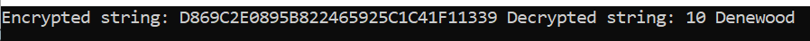

## Overview
Crypto package is used to decrypt values at the moment. It's supported by apps from `.Net Core 3`.

##Usage
Initialize AESService with key and use Decrypt method as show below.

```csharp
Core.Crypto.AESService service = new Core.Crypto.AESService("<key goes here>");

Console.WriteLine($"Encrypted string: D869C2E0895B822465925C1C41F11339 Decrypted string: {service.Decrypt("D869C2E0895B822465925C1C41F11339")}");
```

Below is the output<br/><br/>
